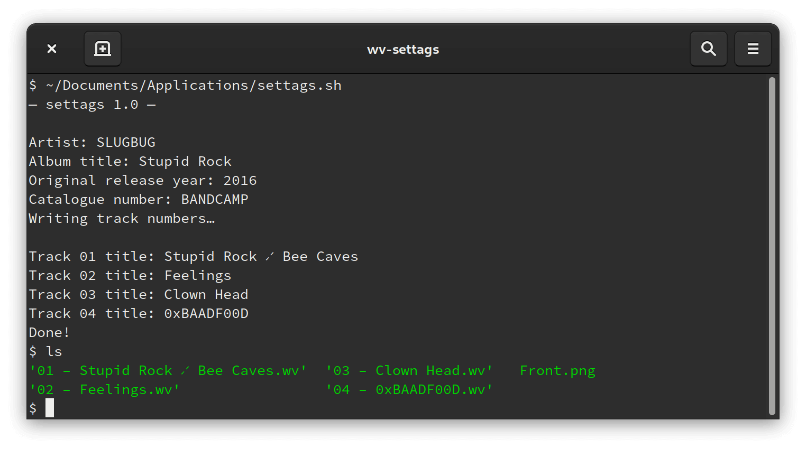

# wv-settags
A simple bash script for bulk tagging WavPack files. Great for adding new albums to your local collection.

## Dependencies
* wavpack (wvtag)
* bash

## Screenshots

## Limitations
Currently, it always adds the same predefined tags and always names files in the same way. This issue will be addressed asap 😕
